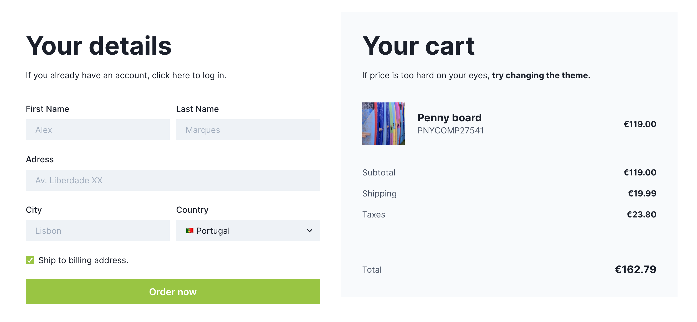

## Motivation

This is a [Next.js](https://nextjs.org/) project bootstrapped with [`create-next-app`](https://github.com/vercel/next.js/tree/canary/packages/create-next-app). The shopping cart example comes from a [egghead.io](https://egghead.io/) course (with a few personal changes). The main goal is to learn more about [ChakraUI](https://chakra-ui.com/).



## How to run

Use the following commands to run the development server:

```bash
npm run dev
# or
yarn dev
```

Open [http://localhost:3000](http://localhost:3000) with your browser to see the result.
